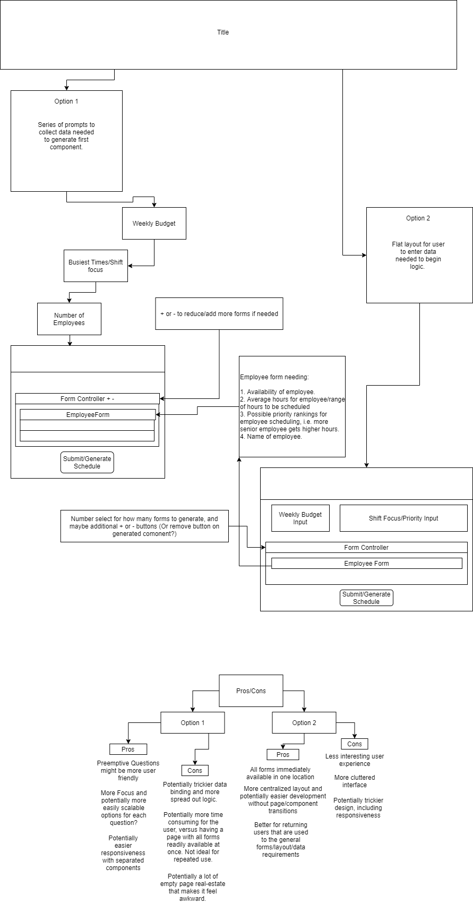

# angularscheduler

Laying out the groundwork for a future angular and material-centered schedule generator. Mapping out component requirements and ui considerations, considering logic needed for schedule generation.

Firstly reviewing Angular course to get a better understanding of the framework and requirements.
